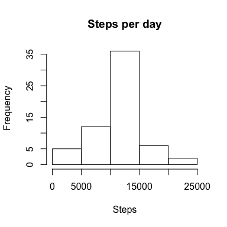

# Reproducible Research: Peer Assessment 1 - Sarah Gilman

## Loading and preprocessing the data

```r
act = read.csv("activity.csv")
actNoNA <- act[complete.cases(act),]
```

## What is mean total number of steps taken per day? 


```r
stepsperday <- aggregate(actNoNA$steps, by=list(actNoNA$date), FUN=sum)
meanSteps <- mean(stepsperday$x)
medianSteps <- median(stepsperday$x)  
hist(stepsperday$x, main="Steps per day", xlab="Steps")
```


The mean number of steps is: 1.0766189\times 10^{4}  
The median number of steps is: 10765  


## What is the average daily activity pattern?  


```r
stepsperinterval <- aggregate(actNoNA$steps, by=list(actNoNA$interval), FUN=mean)
maxinterval <- stepsperinterval[which.max( stepsperinterval$x ), 1]
plot(stepsperinterval, type="l", main="Steps per interval", xlab="Interval", ylab="Steps")
```


The interval with the maximum number of steps was: 835  


## Imputing missing values  


```r
missingRows <- nrow(act) - nrow(actNoNA)
for (r in 1:nrow(act)) {
    if (is.na(act[r,1])) { 
        act[r,1] <- stepsperinterval[ stepsperinterval$Group.1==act[r,3], 2]
    }
}
stepsperdayNA <- aggregate(act$steps, by=list(act$date), FUN=sum)
meanStepsNA <- mean(stepsperdayNA$x)
medianStepsNA <- median(stepsperdayNA$x)  
hist(stepsperdayNA$x, main="Steps per day", xlab="Steps")
```



The mean number of steps is: 1.0766189\times 10^{4}  
The median number of steps is: 1.0766189\times 10^{4}  

All NA values have been replaced with the mean value for that particualr interval accross all days. This did not impact the mean number of steps in a day but did increase the median value.  


## Are there differences in activity patterns between weekdays and weekends?


```r
act$day <- weekdays(as.Date(act[,2]))
for (r in 1:nrow(act)) {
    if (act[r,4]=="Saturday" || act[r,4]=="Sunday") { act[r,4]<-"weekend" }
    else { act[r,4]<-"weekday" }
}
actweek <- subset(act,act[,4]=="weekday")
stepspiweek <- aggregate(actweek$steps, by=list(actweek$interval), FUN=mean)
actend <- subset(act,act[,4]=="weekend")
stepspiend <- aggregate(actend$steps, by=list(actend$interval), FUN=mean)
op <- par(mfcol = c(2,1))
weekplot <- plot(stepspiweek, type="l", main="Weekdays", xlab="Interval", ylab="Steps")
endplot <- plot(stepspiend, type="l", main="Weekends", xlab="Interval", ylab="Steps")
```


```r
par(op)
```

These plots suggest that on weekends, there are fewer steps in the morning and more in the evening. So the individual being measured is sleeping in and staying up.  
